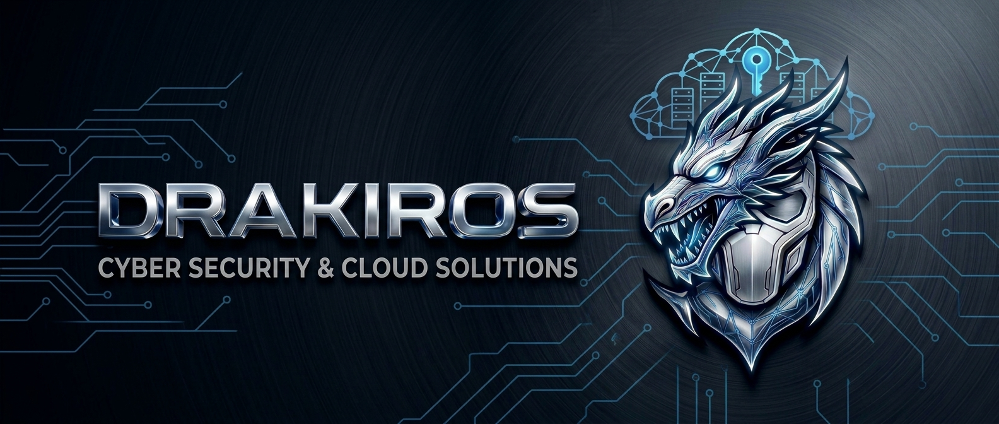

<h1 align="center">
  <a href="https://git.io/typing-svg">
    
  </a>
</h1>
<div align="center">


<br>

<p><b>Electronics & Communications Engineer | Embedded Systems | AI & NLP | Networking & Cybersecurity</b></p>

<p align="center">
  <a href="https://linkedin.com/in/muham2521552il/" target="_blank">
    
  </a>
  &nbsp;&nbsp;
  <a href="https://mail.google.com/mail/?view=cm&fs=1&to=Muhklmlj55521asr@gmail.com" target="_blank">
    
  </a>
  &nbsp;&nbsp;
  
</p>
<details>
<summary><b> 🎧 Coding & Vibing to... : </b></summary>
<br>

<a href="https://youtu.be/CDV0-ArlrXw" target="_blank">
  
</a>

</details>


<br>


</div>

<hr></hr>

## 🚀 About Me
I'm an **Electronics and Communications Engineer** with hands-on training and project experience across:

- 🔧 **Embedded Systems & Microcontroller Programming**
- 🤖 **Artificial Intelligence & Machine Learning**
- 🧠 **Deep Learning & Natural Language Processing (NLP)**
- 🌐 **Networking & Infrastructure**
- 🔐 **Information Security & Privacy**
- 🔬 **PCB Design & Hardware Fabrication**

I enjoy building practical engineering solutions that combine hardware, software, AI, and security.

<hr></hr>

## 🛠️ Technical Skills


```dart
// Makkai's Tech Stack Overview

class About extends Me { 
  const myTools = {  
    "ProgrammingLanguages"   : { "C", "C++", "Python" },
    "AI_and_Data"            : { "Deep Learning (LSTM)", "Machine Learning (K-Means, TF-IDF)", "TensorFlow", "Keras", "Scikit-Learn" },
    "Embedded_and_Hardware"  : { "AVR ATmega32", "Bare-Metal C", "GPIO", "Timers", "LCD", "ADC", "UART", "I2C", "PCB Design & Fabrication" },
    "Networking_and_Security": { "Cisco Packet Tracer", "Routing & Switching", "IP Subnetting", "OSI Model", "Web Security (XSS)" },
    "Platforms_and_Tools"    : { "Proteus" }
  };
};
```

<hr>

<p align="center">
  
</p>
